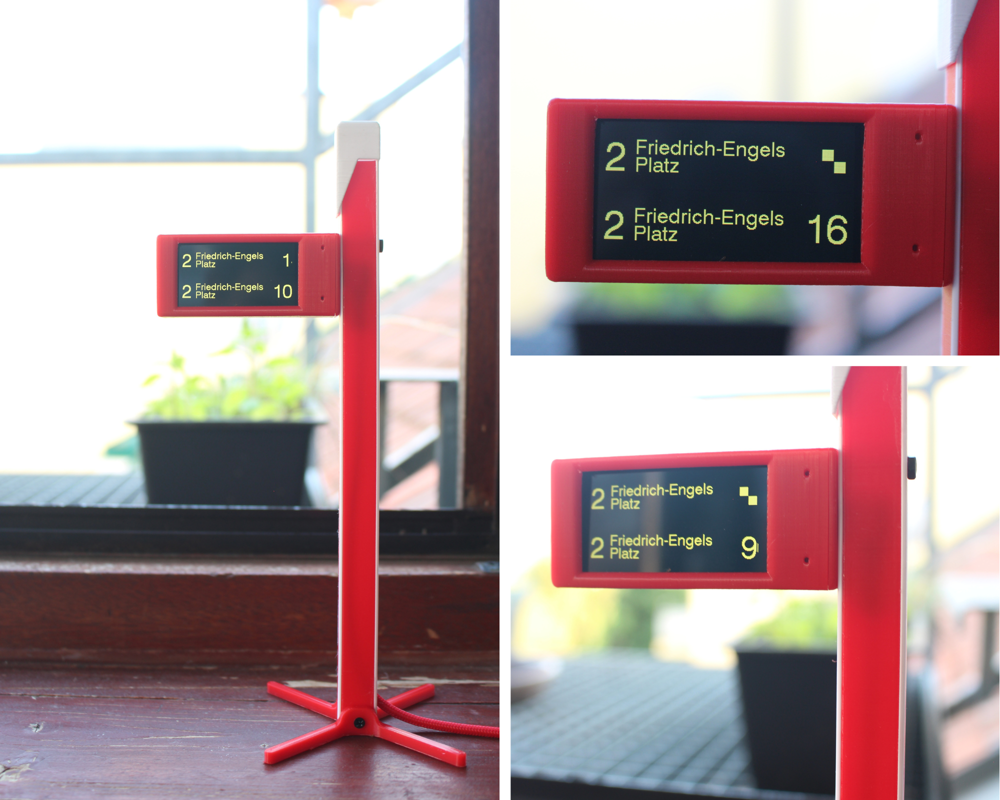

# LineTracker

**Echtzeit-Abfahrtsmonitor für Wien – im Stil der echten Fahrgastinformationssysteme.**

von Leo Blum

---



LineTracker verwandelt ein LILYGO T-Display-S3 in einen kompakten Abfahrtsmonitor im Amber-Dot-Matrix-Look – genau wie die Anzeigetafeln an Wiens U-Bahn- und Straßenbahnstationen. Einmal einrichten, fertig. Kein Code anfassen, kein Technikkenntnisse nötig.

---

## Features

- **Echtzeit-Abfahrten** — U-Bahn, Straßenbahn, Bus (Wiener Linien) **und** S-Bahn, REX & Züge (ÖBB)
- **Authentischer Amber-Dot-Matrix-Look** — originalgetreuer Fahrgastinformationssystem-Style
- **Einfaches WLAN-Setup** — ESP baut beim ersten Start ein eigenes Netzwerk auf, WLAN-Daten einmal eingeben, fertig
- **Browser-Konfiguration** — alles über `linetracker.local` einstellbar, keine App nötig
- **Stationssuche** — nach Name suchen oder A-Z durchblättern
- **Linien & Richtungen wählbar** — genau auswählen was angezeigt werden soll
- **Nachtmodus** — automatisches Dimmen zwischen konfigurierbaren Uhrzeiten
- **Störungsticker** — aktuelle Betriebsstörungen werden unten eingeblendet
- **OTA-Updates** — Firmware-Updates automatisch über WLAN, kein Kabel nötig
- **WLAN-Wechsel** — Heimnetz ändern ohne die Konfiguration zu verlieren
- **Geschenk-tauglich** — entwickelt damit es jeder ohne Vorkenntnisse aufstellen kann

---

## Hardware

| Komponente | Details |
|---|---|
| Board | LILYGO T-Display-S3 1.9" (~10–15 € auf AliExpress) |
| Display | 170×320px ST7789, 8-bit parallel |
| Framework | PlatformIO + Arduino + ESP-IDF (FreeRTOS) |

---

## Einrichtung

### 1. Flashen

```bash
git clone https://github.com/blumleo2004/linetracker.git
cd linetracker
pio run --target upload
```

Upload-Speed: 115200 Baud. Falls der Upload fehlschlägt: BOOT gedrückt halten während RST gedrückt wird, um in den Download-Modus zu kommen.

### 2. WLAN verbinden

1. Mit dem Handy oder Laptop mit dem WLAN **„LineTracker"** verbinden
2. Heimnetz auswählen und Passwort eingeben
3. **linetracker.local** im Browser öffnen

### 3. Linien einrichten

**Wiener Linien (U-Bahn, Straßenbahn, Bus):**
Station nach Name suchen oder A-Z durchblättern, dann Linien und Richtungen auswählen.

**ÖBB (S-Bahn, REX, Züge):**
Unter „S-Bahn / Züge" Station suchen (z. B. „Wien Rennweg"), Linie und Richtung wählen.

---

## Einstellungen

| Einstellung | Beschreibung |
|---|---|
| Seitenwechsel | Rotationsintervall der Seiten (2–30 Sekunden) |
| Helligkeit | Display-Helligkeit |
| Nachtmodus | Automatisches Dimmen zwischen konfigurierbaren Uhrzeiten |
| Nächste Abfahrt | Nächste Abfahrt unterhalb des Countdowns anzeigen |
| Störungsticker | Betriebsstörungen am unteren Rand einblenden |

---

## Buttons

| Aktion | Ergebnis |
|---|---|
| BOOT 3 Sek. halten | WLAN-Reset (öffnet Setup-Portal, Konfiguration bleibt erhalten) |
| BOOT 10 Sek. halten | Factory-Reset (alles wird gelöscht) |

---

## OTA-Updates

LineTracker prüft alle 6 Stunden automatisch auf neue Firmware. Manuell auslösbar über **linetracker.local/update**.

Siehe [OTA_UPDATE.md](OTA_UPDATE.md) für Details zum Veröffentlichen neuer Releases.

---

## Datenquellen

| Quelle | Anbieter | Lizenz |
|---|---|---|
| Echtzeit-Abfahrten | [Wiener Linien](https://www.wienerlinien.at) | OGD |
| Stations- & Liniendaten | [Stadt Wien – data.wien.gv.at](https://data.wien.gv.at) | CC BY 4.0 |
| S-Bahn / Zugabfahrten | [ÖBB/SCOTTY](https://fahrplan.oebb.at) | — |

Kein API-Key erforderlich.

---

## Verwendete Libraries

- [TFT_eSPI](https://github.com/Bodmer/TFT_eSPI) — Display-Treiber
- [ArduinoJson](https://arduinojson.org/) v7 — JSON-Parsing
- [WiFiManager](https://github.com/tzapu/WiFiManager) — WLAN-Setup-Portal

---

## Lizenz

MIT
